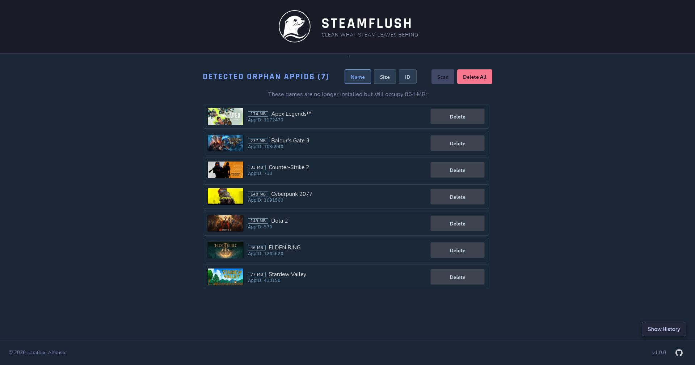
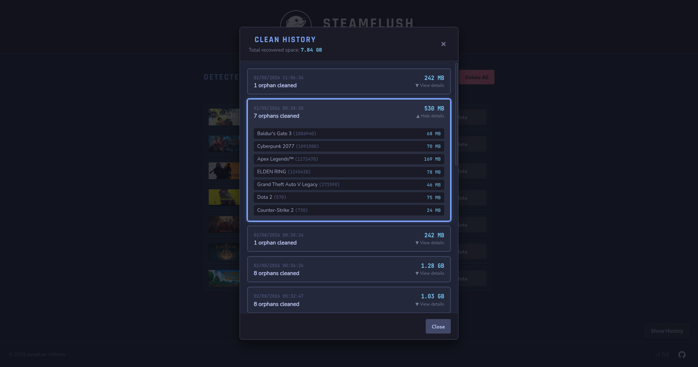
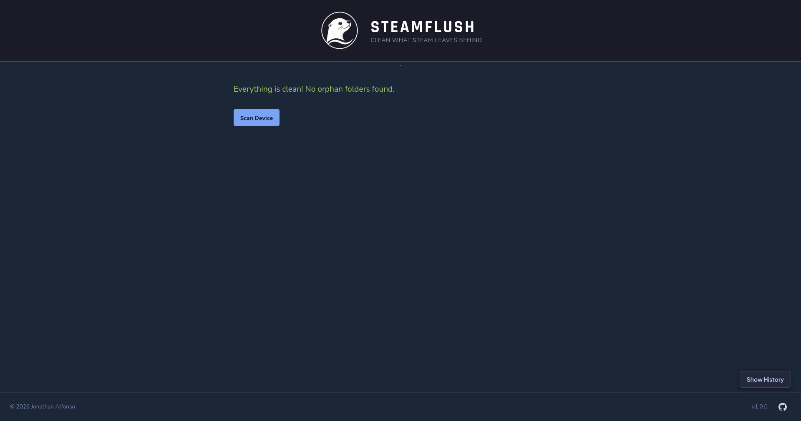

# SteamFlush

  Linux & Steam Deck Ready
  GPL-3.0 License

**SteamFlush** is a lightweight, open-source desktop utility built with **Go** and **Wails** to help you reclaim disk space by safely removing orphaned shader caches from your Steam library on Linux and Steam Deck.

  <a href="https://github.com/heavystudio/steamflush/releases" class="btn-cta">Download Latest Release</a>
  <a href="https://github.com/heavystudio/steamflush" style="margin-left: 15px;">View on GitHub</a>

## Screenshots

  

    
    
Main Window

  

  

    
    
Clean History

  

  

    
    
System Clean

  

## Key Features

* **Automatic Detection:** Scans your Steam library to identify leftover shader cache directories from uninstalled games.
* **Safe & Transparent:** Preview associated games and directory paths before taking any destructive action.
* **Fast & Lightweight:** Native binary execution with low memory usage and instant startup.
* **Flatpak Ready:** Easily install and update via Flatpak or standalone Linux binaries.

## How It Works

1. **Scan:** SteamFlush automatically detects your Steam installation paths and scans for orphaned shader caches.
2. **Review:** Inspect the list of uninstalled games and check how much disk space you can recover.
3. **Clean:** Safely delete selected cache folders in a single click.

## Installation

### Flatpak

Download the `.flatpak` bundle directly from the releases page and install it via your software center or command line:

    flatpak install steamflush.flatpak

### Direct Download

Grab the pre-compiled binary directly from the [GitHub Releases](https://github.com/heavystudio/steamflush/releases) page.

## Frequently Asked Questions

**Is it safe to delete shader caches?**  
➔ Yes. Shader caches are auto-generated. Deleting caches for uninstalled games frees up disk space without affecting your installed games or save files.

**Does it support secondary drives and SD cards?**  
➔ Yes, SteamFlush automatically scans custom Steam library folders across all mounted drives and SD cards.

**Will Steam regenerate shader caches if I reinstall a game?**  
➔ Yes. If you reinstall a game, Steam will automatically download or compile the necessary shader cache files again.

**Can SteamFlush touch my save files or game configurations?**  
➔ No. SteamFlush strictly targets the `shadercache` directories and ignores save data, `compatdata` (Proton prefixes), or configuration files.

**Does SteamFlush require root permissions?**  
➔ No. SteamFlush operates entirely in user space within your user's write permissions, making it completely safe for your system.